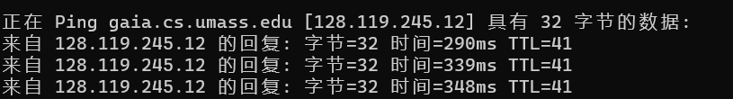

# Computer Network Study Lab 1

---

- Author:PB19000362 钟书锐
- Time:2021.9.16

### Q1:List 3 different protocols that appear in the protocol column in the unfilteredpacket-listing window in step 7 above.

- TCP,TLVS1.2,HTTP,ARP,UDP ......

### Q2:How long did it take from when the HTTP GET message was sent until the HTTP OK reply was received?

- 0.261294s

### Q3:What is the Internet address of the gaia.cs.umass.edu ? What is the Internet address of your computer?

- my computer: `192.168.110.57`
- gaia.cs.umass.edu: `128.119.245.12`
- You can both use wireshark or the cmd `ping www-net.cs.umass.edu` to get the ip.
  

### Q4:Print the two HTTP messages (GET and OK) referred to in question 2 above.

- See the next page.
