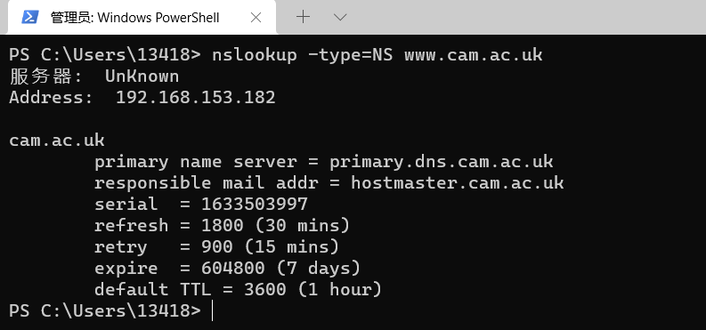
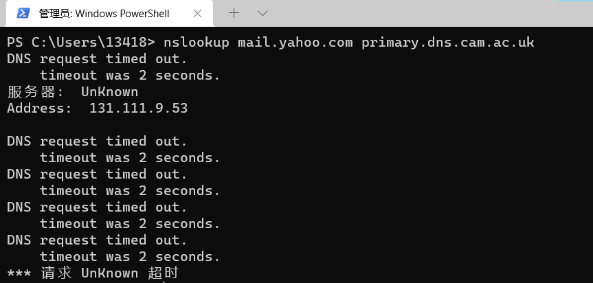

# Computer Network Study Lab 3

---

- Author:PB19000362 钟书锐
- Time:2021.10.6

## 1. nslookup

### Q1.Run nslookupto obtain the IP address of a Web server in Asia. What is the IP address of that server?

- Addresses:
  2001:da8:d800:642::246
  202.38.64.246

### Q2.Run nslookupto determine the authoritative DNS servers for a university in Europe.

### Q3.Run nslookupso that one of the DNS servers obtained in Question 2 is queried for the mail servers for Yahoo! mail. What is its IP address?

查询失败

## 2.ipconfig

## 3.Tracing DNS with Wireshark

### Q4. Locate the DNS query and response messages. Are then sent over UDP or TCP?

- UDP

### Q5. What is the destination port for the DNS query message? What is the source port of DNS response message?

- 53
  

### Q6. To what IP address is the DNS query message sent? Use ipconfig to determine the IP address of your local DNS server. Are these two IP addresses the same?

- 192.168.153.182
- same

### Q7. Examine the DNS query message. What “Type” of DNS query is it? Does the query message contain any “answers”?

- 
- type A
- no any “answers”

### Q8. Examine the DNS response message. How many “answers” are provided? What do each of these answers contain?

- 
- 3

### Q9. Consider the subsequent TCP SYN packet sent by your host. Does the destination IP address of the SYN packet correspond to any of the IP addresses provided in the DNS response message?

- 
- 
- yes

### Q10. This web page contains images. Before retrieving each image, does your host issue new DNS queries?

- no

### Q11. What is the destination port for the DNS query message? What is the source port of DNS response message?

- 53
- 

### Q12. To what IP address is the DNS query message sent? Is this the IP address of your default local DNS server?

- 192.168.153.182
- yes
- 
- 

### Q13. Examine the DNS query message. What “Type” of DNS query is it? Does the query message contain any “answers”?

- 
- type A
- no any “answers”

### Q14. Examine the DNS response message. How many “answers” are provided? What do each of these answers contain?

- 3
- 

### Q15. Provide a screenshot.

- 

### Q16. To what IP address is the DNS query message sent? Is this the IP address of your default local DNS server?

- 
- 
- 192.168.153.182
- yes

### Q17. Examine the DNS query message. What “Type” of DNS query is it? Does the query message contain any “answers”?

- 
- type NS
- no any “answers”

### Q18. Examine the DNS response message. What MIT nameservers does the response message provide? Does this response message also provide the IP addresses of the MIT namesers?

- 

- mit.edu nameserver = asia1.akam.net
- mit.edu nameserver = asia2.akam.net
- mit.edu nameserver = use2.akam.net
- mit.edu nameserver = eur5.akam.net
- mit.edu nameserver = ns1-37.akam.net
- mit.edu nameserver = ns1-173.akam.net
- mit.edu nameserver = usw2.akam.net
- mit.edu nameserver = use5.akam.net

- yes,in Additional records.
  - use5.akam.net: type AAAA, class IN, addr 2600:1403:a::40
  - eur5.akam.net: type A, class IN, addr 23.74.25.64
  - use2.akam.net: type A, class IN, addr 96.7.49.64
  - usw2.akam.net: type A, class IN, addr 184.26.161.64
  - use5.akam.net: type A, class IN, addr 2.16.40.64

### Q19. Provide a screenshot

- 

### Q20. To what IP address is the DNS query message sent? Is this the IP address of your default local DNS server? If not, what does the IP address correspond to?

- 
- 访问 bitsy.mit.edu
  - yes
  - 192.168.153.182
- 访问 www.aiit.or.kr
  - no
  - 18.0.72.3
  - 不是默认本地 DNS 服务器的 IP 地址，是 bitsy.mit.edu 这个域名服务器的 IP 地址。

### Q21. Examine the DNS query message. What “Type” of DNS query is it? Does the query message contain any “answers”?

- 
- type:A
- no answer

### Q22. Examine the DNS response message. How many “answers” are provided? What does each of these answers contain?

- 
- no respose.
- 0

### Q23. Provide a screenshot

- 
- 
