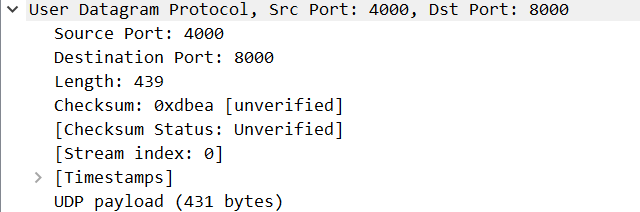
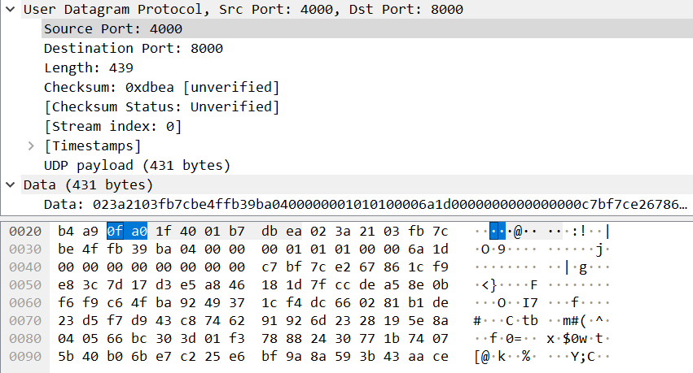
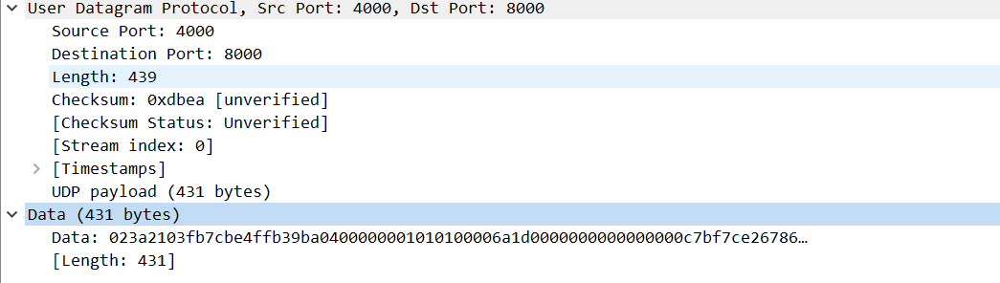
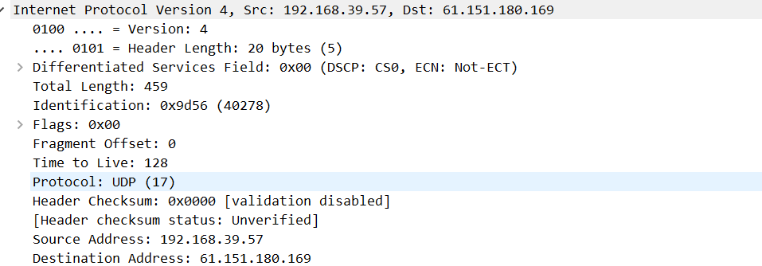
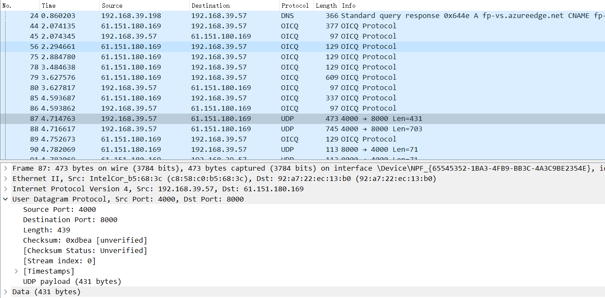
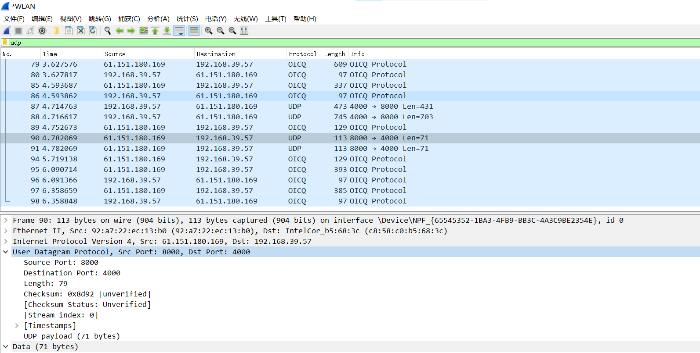

# Computer Network Study Lab 4

---

- Author:PB19000362 钟书锐
- Time:2021.10.15

### Q1. Select one UDP packet from your trace. From this packet, determine how many fields there are in the UDP header. (You shouldn’t look in the textbook! Answer these questions directly from what you observe in the packet trace.) Name these fields.

- How many fields in the UDP header：
  UDP 头部一共有四个字段：分别是 Source Port，Destination Port，Length，Checksum
- eg:抓的包为例
  - User Datagram Protocol, Src Port: 4000, Dst Port: 8000
  - Source Port: 4000
  - Destination Port: 8000
  - Length: 439
  - Checksum: 0xdbea [unverified]

### Q2. By consulting the displayed information in Wireshark’s packet content field for this packet, determine the length (in bytes) of each of the UDP header fields.

- UDP 头部的大小: `439 bytes - 431 bytes = 8bytes`
- 比如截图中
  1. 0f a0 2 个字节代表 Source Port: 4000
  2. 1f 40 2 个字节代表 Destination Port: 8000
  3. 01 b7 2 个字节代表 Length: 439
  4. db ea 2 个字节代表 Checksum: 0xdbe
- 所以 UDP 头部的每个字段的大小 : 2 bytes

### Q3. The value in the Length field is the length of what? (You can consult the text for this answer). Verify your claim with your captured UDP packet.

- Length 表示整个 UDP 报文段的字节数（首部加数据）
- length = 8（UDP 头部的大小） + lenth of the data
- eg:抓的包为例
  1. lenth = 439 bytes
  2. lenth of the data:431 bytes

### Q4. What is the maximum number of bytes that can be included in a UDP payload? (Hint: the answer to this question can be determined by your answer to 2. above)

- length 为 2 字节(16 位),
- 所以 lenth 最大值为 max_lenth=2^16-1=65535 代表 65535 bytes
- payload 有效负载只包含 data 段，减去 UDP 头部大小
- max_lenth -8 = 65527 bytes
- 所以 UDP 最大有效负载 65527 bytes

### Q5. What is the largest possible source port number? (Hint: see the hint in 4.)

- source port number 也是 2 字节(16 位)
- 最大值为 max_port number=2^16-1=65535
- source port number 的范围 0-65535
- 最大源端口号是 65535

### Q6. What is the protocol number for UDP? Give your answer in both hexadecimal and decimal notation. To answer this question, you’ll need to look into the Protocol field of the IP datagram containing this UDP segment (see Figure 4.13 in the text, and the discussion of IP header fields).

- Protocol: UDP (17)
- The UDP protocol number in decimal is: 17
- The UDP protocol number in hexadecimal is: 0x11

### Q7. Examine a pair of UDP packets in which your host sends the first UDP packet and the second UDP packet is a reply to this first UDP packet. (Hint: for a second packet to be sent in response to a first packet, the sender of the first packet should be the destination of the second packet). Describe the relationship between the port numbers in the two packets.

- 第一个 packet 的源端口号是第二个 packet 的目标端口号
- 第二个 packet 的源端口号是第一个 packet 的目标端口号
- 例如
  - 第一个包源端口号是 4000 目标端口号是 8000
  - 第二个包源端口号是 8000 目标端口号是 4000
