# Computer Network Study Lab 5

---

- Author:PB19000362 钟书锐
- Time:2021.10.29

## 1. Capturing a bulk TCP transfer from your computer to a remote server

- 下载的 Wireshark 捕获的数据包文件 Stcp-ethereal-trace-1
  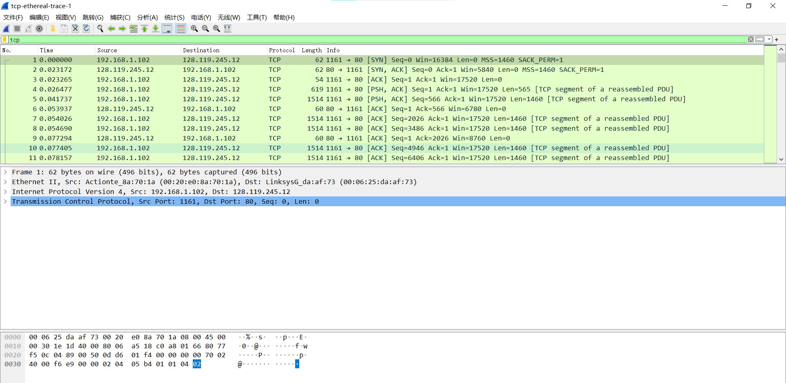

- 自己抓的包
  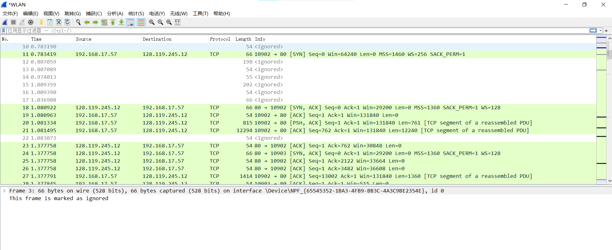

## 2. A first look at the captured trace

### Q1.What is the IP address and TCP port number used by the client computer (source) that is transferring the file to gaia.cs.umass.edu? To answer this question, it’s probably easiest to select an HTTP message and explore the details of the TCP packet used to carry this HTTP message, using the “details of the selected packet header window” (refer to Figure 2 in the “Getting Started with Wireshark” Lab if you’re uncertain about the Wireshark windows.

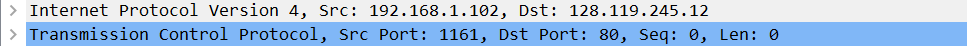

- Internet Protocol Version 4, Src: 192.168.1.102, Dst: 128.119.245.12
- Transmission Control Protocol, Src Port: 1161, Dst Port: 80, Seq: 0, Len: 0

### Q2.What is the IP address of gaia.cs.umass.edu? On what port number is it sending and receiving TCP segments for this connection?

- ip address of gaia.cs.umass.edu is 128.119.245.12
- On port number 80

### Q3. What is the IP address and TCP port number used by your client computer (source) to transfer the file to gaia.cs.umass.edu?

by my client computer

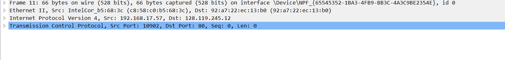

- IP address is 192.168.17.57
- port number is 10902

## 3.TCP Basics

### Q4. What is the sequence number of the TCP SYN segment that is used to initiate the TCP connection between the client computer and gaia.cs.umass.edu? What is it in the segment that identifies the segment as a SYN segment?

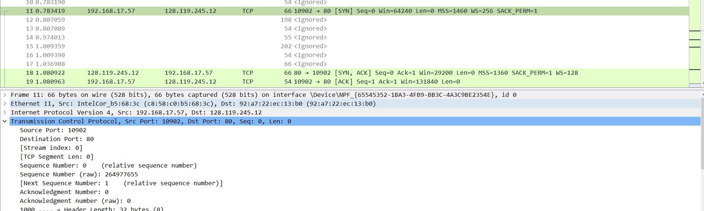

- Sequence Number: 0 (relative sequence number)
- Sequence Number (raw): 264977655
- 第一次握手
- 建立连接

### Q5. What is the sequence number of the SYNACK segment sent by gaia.cs.umass.edu to the client computer in reply to the SYN? What is the value of the Acknowledgement field in the SYNACK segment? How did gaia.cs.umass.edu determine that value? What is it in the segment that identifies the segment as a SYNACK segment?

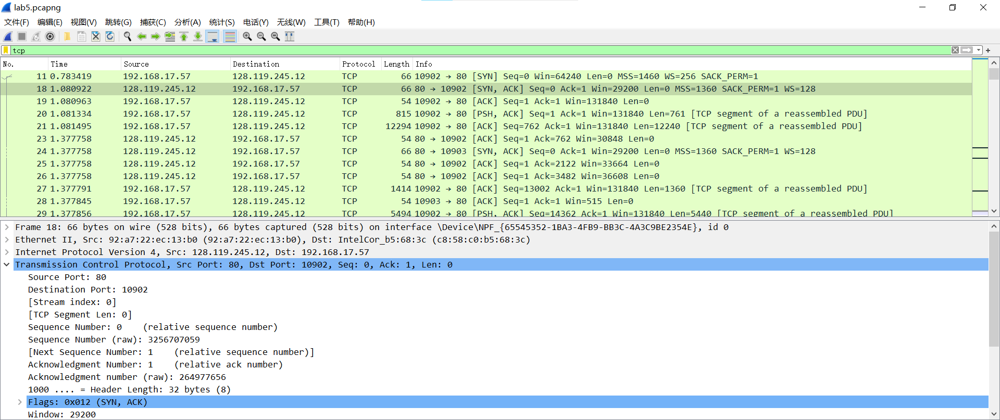

- Sequence Number: 0 (relative sequence number)
- Sequence Number (raw): 3256707059
- Acknowledgment Number: 1 (relative ack number)
- Acknowledgment number (raw): 264977656
- ACK=SYN 中的 Seq 值加 1
- 第 2 次握手
- 确认客户端的连接，选择服务器端初始的序列号

### Q6. What is the sequence number of the TCP segment containing the HTTP POST command? Note that in order to find the POST command, you’ll need to dig into the packet content field at the bottom of the Wireshark window, looking for a segment with a “POST” within its DATA field.

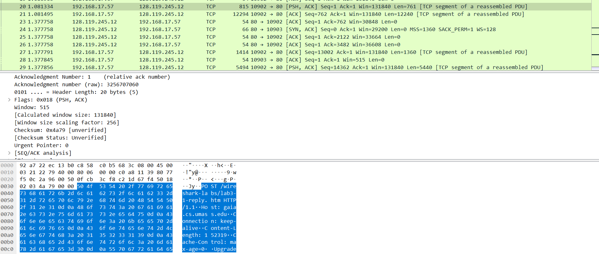

- Sequence Number: 1 (relative sequence number)
- Sequence Number (raw): 264977656

### Q7. Consider the TCP segment containing the HTTP POST as the first segment in the TCP connection. What are the sequence numbers of the first six segments in the TCP connection (including the segment containing the HTTP POST)? At what time was each segment sent? When was the ACK for each segment received? Given the difference between when each TCP segment was sent, and when its acknowledgement was received, what is the RTT value for each of the six segments? What is the EstimatedRTT value (see Section 3.5.3, page 242 in text) after the receipt of each ACK? Assume that the value of the EstimatedRTT is equal to the measured RTT for the first segment, and then is computed using the EstimatedRTT equation on page 242 for all subsequent segments.

- 因为自己抓下来的包有一点问题
- 此题按照下下来的数据包文件 Stcp-ethereal-trace-1 作答
- 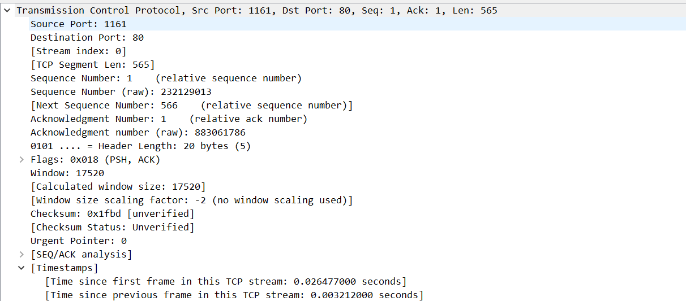
  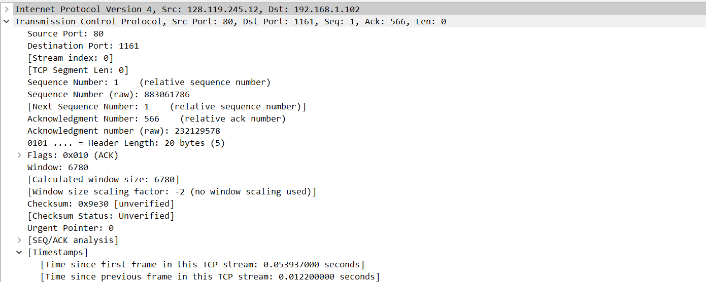

  1. Sequence Number: 1 (relative sequence number)
  2. 发送时间[Time since first frame in this TCP stream: 0.026477 seconds]
  3. Acknowledgment Number: 566 (relative ack number)
  4. ACK 时间[Time since first frame in this TCP stream: 0.053937 seconds]
  5. RTT:0.02746s
  6. EstimatedRTT:0.02746s

- 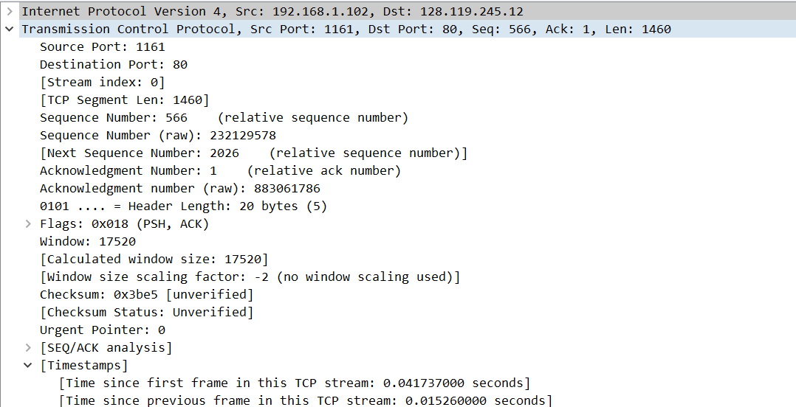
  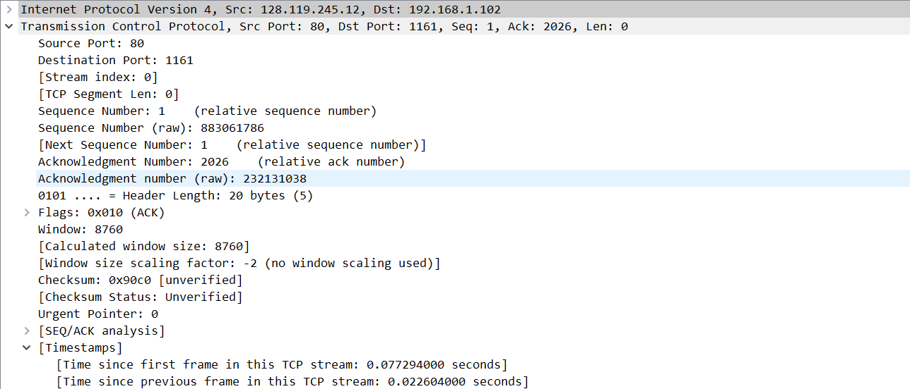

  1. Sequence Number: 566 (relative sequence number)
  2. 发送时间[Time since first frame in this TCP stream: 0.041737 seconds]
  3. Acknowledgment Number: 2026 (relative ack number)
  4. ACK 时间[Time since first frame in this TCP stream: 0.077294 seconds]
  5. RTT:0.035557s
  6. EstimatedRTT:0.028472s

- 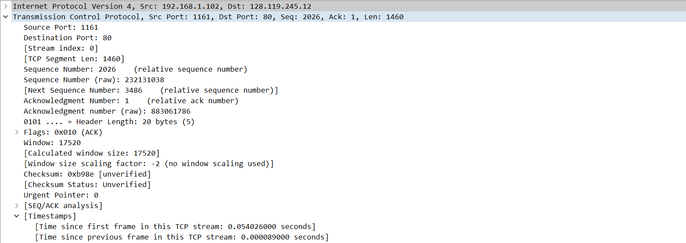
  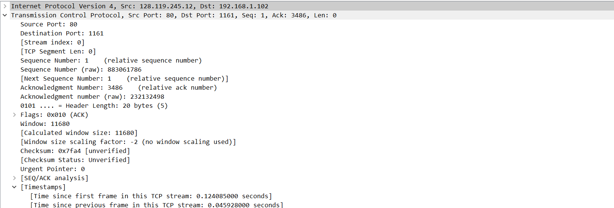

  1. Sequence Number: 2026 (relative sequence number)
  2. 发送时间[Time since first frame in this TCP stream: 0.054026 seconds]
  3. Acknowledgment Number: 3486 (relative ack number)
  4. ACK 时间[Time since first frame in this TCP stream: 0.124085 seconds]
  5. RTT:0.070059‬‬ s
  6. EstimatedRTT:0.033670s

- 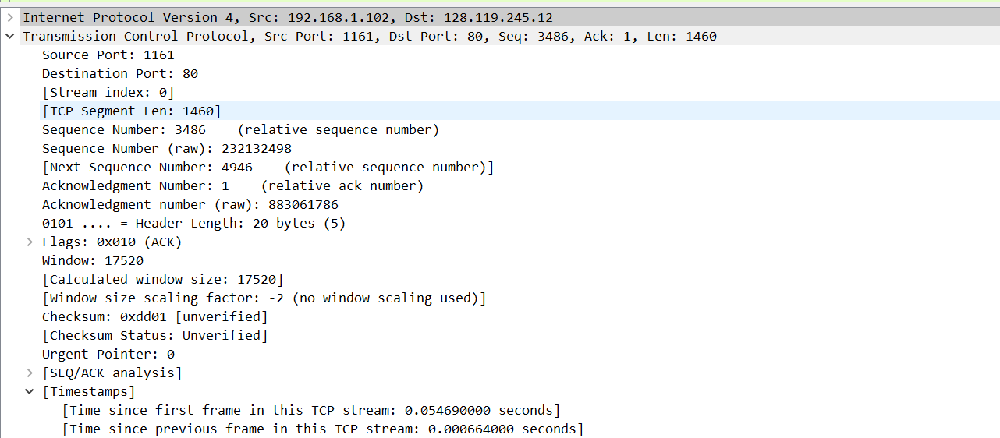
  

  1. Sequence Number: 3486 (relative sequence number)
  2. 发送时间[Time since first frame in this TCP stream:0.054690 seconds]
  3. Acknowledgment Number: 4946 (relative ack number)
  4. ACK 时间[Time since first frame in this TCP stream: 0.169118 seconds]
  5. RTT:0.114428 s
  6. EstimatedRTT:0.043765s

- 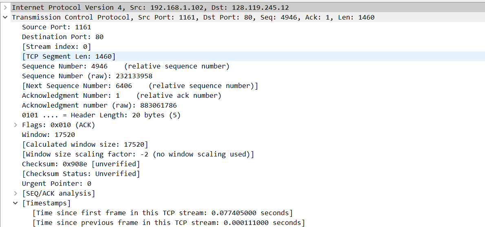
  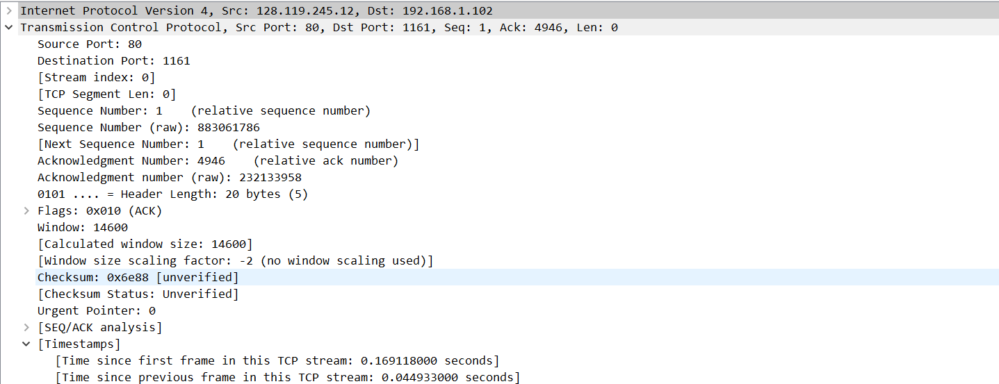

  1. Sequence Number: 4946 (relative sequence number)
  2. 发送时间[Time since first frame in this TCP stream:0.077405 seconds]
  3. Acknowledgment Number: 6406 (relative ack number)
  4. ACK 时间[Time since first frame in this TCP stream:0.217299 seconds]
  5. RTT: 0.139894‬‬ s
  6. EstimatedRTT:0.055781S
     ‬‬

- 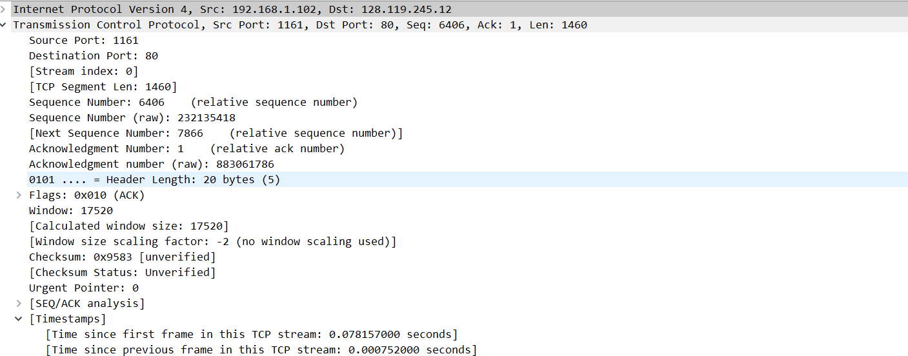
  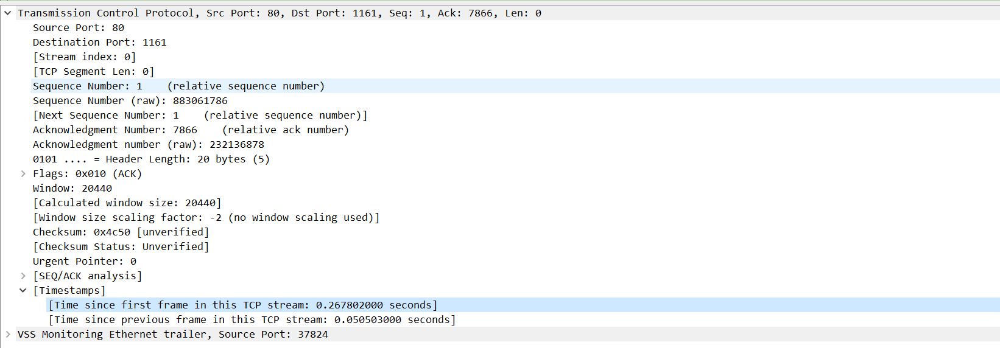
  1. Sequence Number: 6406 (relative sequence number)
  2. 发送时间[Time since first frame in this TCP stream:0.078157 seconds]
  3. Acknowledgment Number: 7866 (relative ack number)
  4. ACK 时间[Time since first frame in this TCP stream:0.2678029 seconds]
  5. RTT: 0.189645‬‬ s
  6. EstimatedRTT:0.072514S

### Q8.What is the length of each of the first six TCP segments?

- lenth:565，1460，1460，1460，1460，1460

### Q9. What is the minimum amount of available buffer space advertised at the received for the entire trace? Does the lack of receiver buffer space ever throttle the sender?

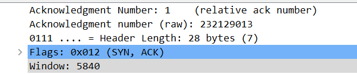

- 接收窗口最小为 5840。缺少接收窗口会限制发送方发送 TCP 报文
- 包中接收窗口大于发送的报文数量，因此不会限制

### Q10. Are there any retransmitted segments in the trace file? What did you check for (in the trace) in order to answer this question?

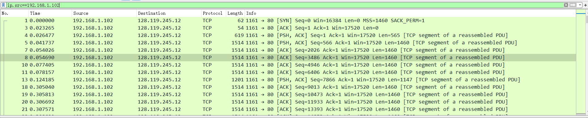
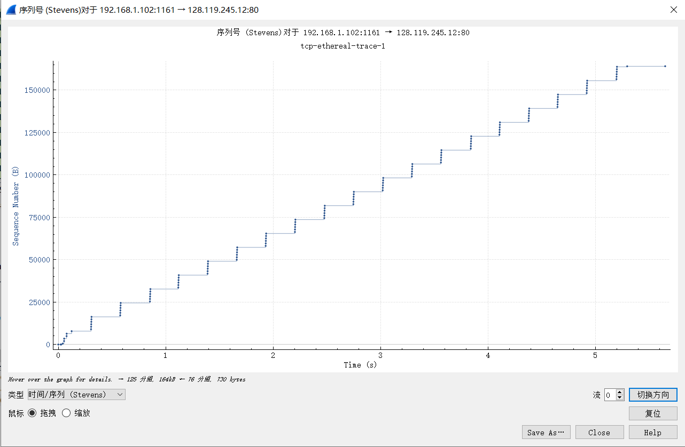

- ip.src==192.168.1.102
- 没有重传，seq 一直在增加

### Q11. How much data does the receiver typically acknowledge in an ACK? Can you identify cases where the receiver is ACKing every other received segment (see Table 3.2 on page 250 in the text).

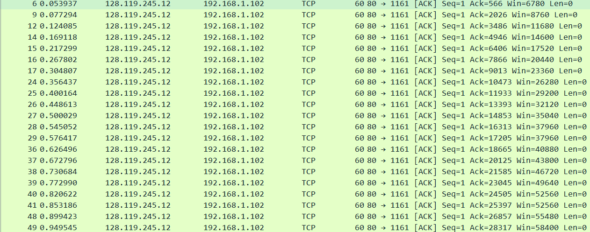

- 1460 bytes
- 可以 比较 2 个连续的 ACK 的差值，就是接受的数据

### Q12. What is the throughput (bytes transferred per unit time) for the TCP connection? Explain how you calculated this value.

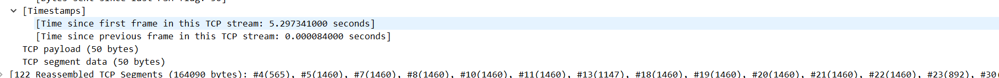
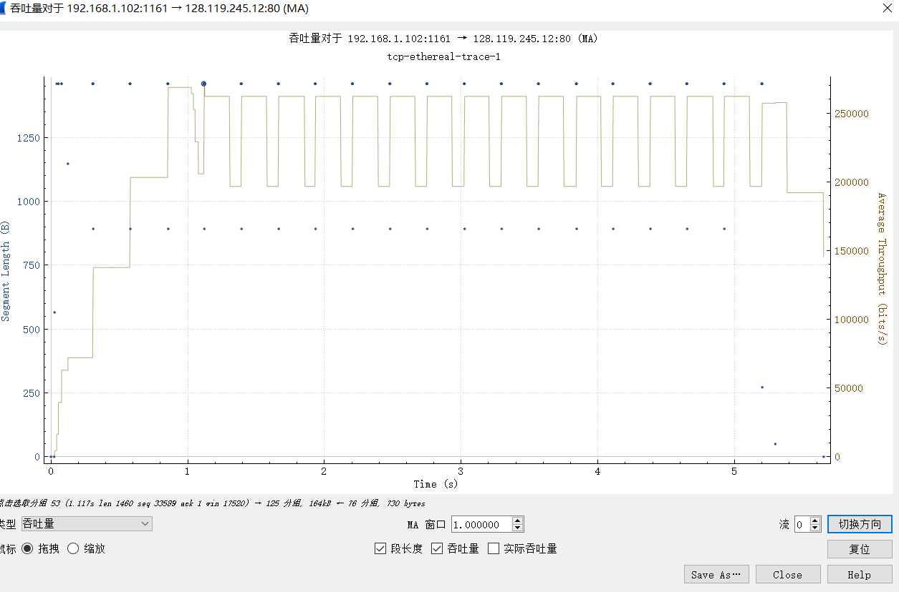
[Time since first frame in this TCP stream: 5.297341000 seconds]
[122 Reassembled TCP Segments (164090 bytes): #4(565), #5(1460), #7(1460), #8(1460), #10(1460), #11(1460), #13(1147), #18(1460), #19(1460), #20(1460), #21(1460), #22(1460), #23(892), #30(1460), #31(1460), #32(1460), #33(1460), #34(1460), #3]

- 吞吐量为 Reassembled TCP Segments/Time since first frame in this TCP stream
- 代入 164090bytes/5.2973seconds=30976.1bytes/seconds

## 4. TCP congestion control in action

### Q13. Use the Time-Sequence-Graph(Stevens) plotting tool to view the sequence number versus time plot of segments being sent from the client to the gaia.cs.umass.edu server. Can you identify where TCP’s slowstart phase begins and ends, and where congestion avoidance takes over? Comment on ways in which the measured data differs from the idealized behavior of TCP that we’ve studied in the text.

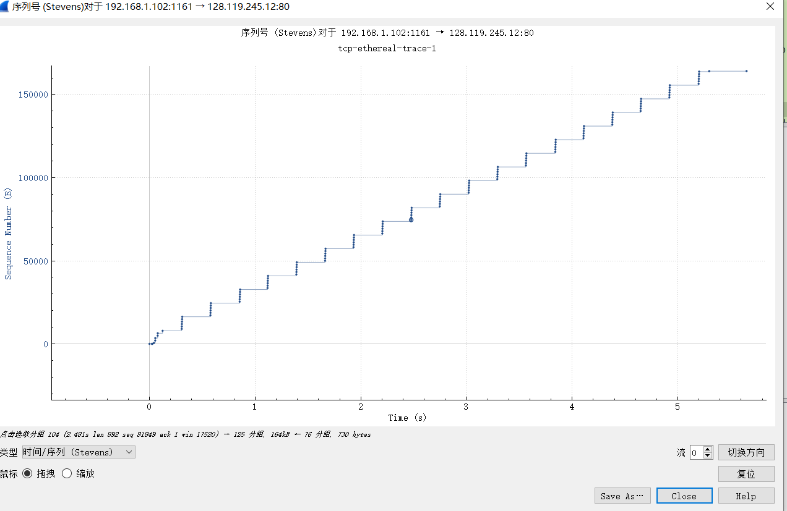

- 0-0.124s 为慢启动阶段
- 后面拥塞避免阶段
- 实际的图不是书上严格意义上指数和线性的关系，有波动

### Q14. Answer each of two questions above for the trace that you have gathered when you transferred a file from your computer to gaia.cs.umass.edu

- 看不太出来慢启动阶段 感觉大概 1.08s?
