# Computer Network Study Lab 6

---

- Author:PB19000362 钟书锐
- Time:2021.11.24

## 1. Capturing packets from an execution of traceroute

- 本人选择的网站为 ustc.edu.cn，对应ip地址为202.38.64.246
- 可以在pingplotter 中显式设置ICMP echo 请求消息的大小，默认数据包大小为56个字节。
  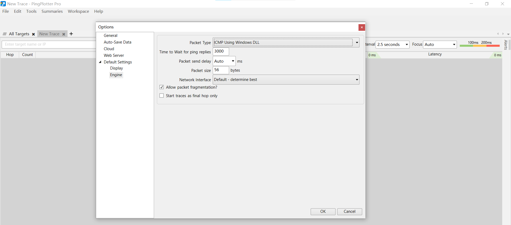
- 在pingplotter 三次不同Packet Size 发送之后结果
  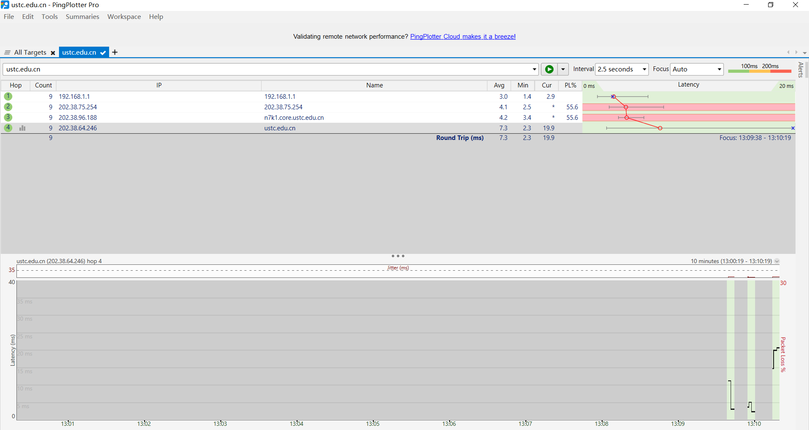
- wireshark抓包结果
  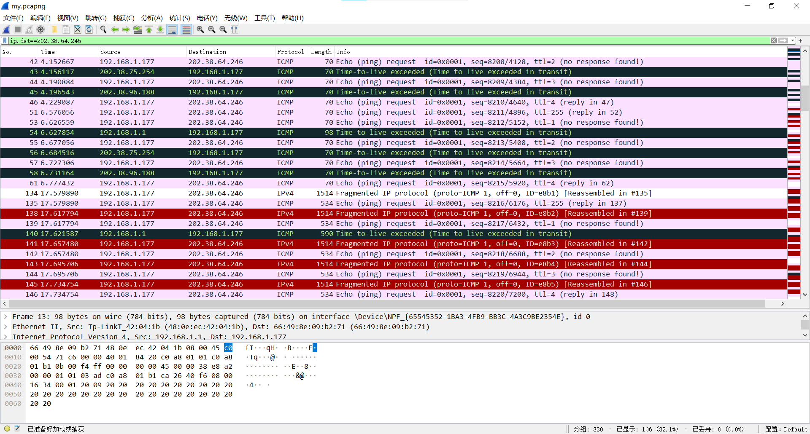

## 2. A look at the captured trace

- **因为自己抓的包比较乱，以下回答基于下载的ip-ethereal-trace-1**

### Q:1.Select the first ICMP Echo Request message sent by your computer, and expand the Internet Protocol part of the packet in the packet details window.What is the IP address of your computer?

- 下载的ip-ethereal-trace-1
- 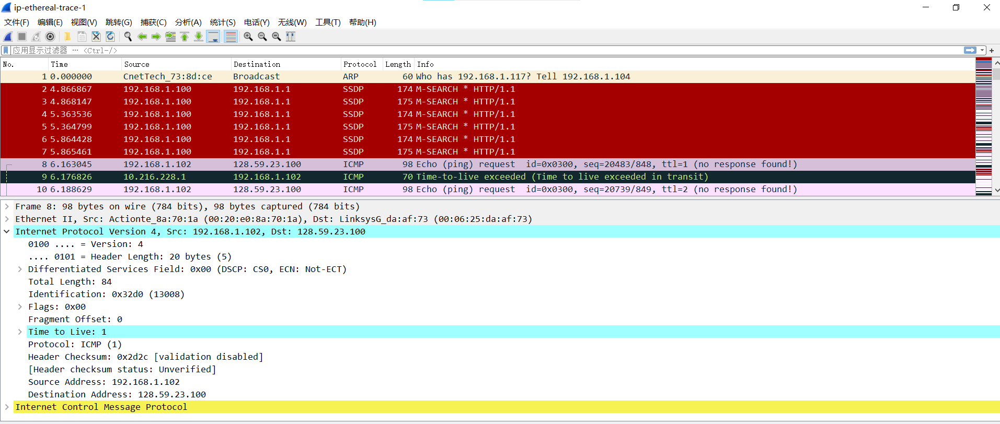
- 自己抓取的包
- 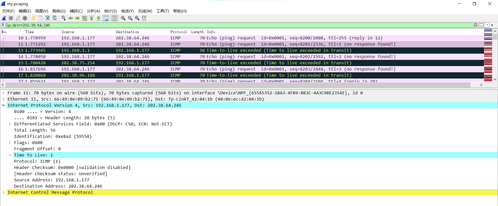

- IP 地址 是 192.168.1.102（此处是下载到的包抓取人的ip地址）
- IP 地址 是 192.168.1.177

### Q:2.Within the IP packet header, what is the value in the upper layer protocol field?

- 
- 上层协议就是ICMP，值为1。 Protocol: ICMP (1)

### Q:3.How many bytes are in the IP header? How many bytes are in the payload of the IP datagram?  Explain how you determined the number of payload bytes

- 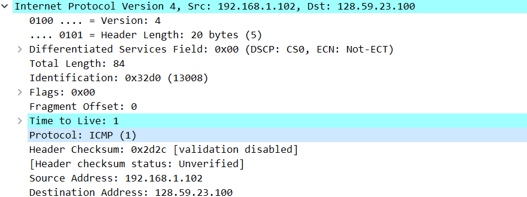
- Header Length：20 bytes
- IP datagram payload bytes：64bytes
- explain how:
  - IP数据报总长度 = IP头长度 + IP数据长度(payload bytes)
  - 已知IP头长度20bytes，总长度total lenth 84bytes
  - payload bytes为84-20=64bytes

### Q:4.Has this IP datagram been fragmented?  Explain how you determined whether or not the datagram has been fragmented

- 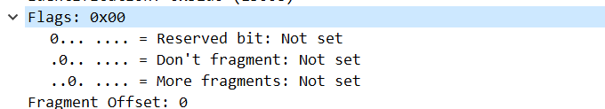
- IP数据报没有被分段
- explain how:
  - Fragment Offset：该片偏移原始数据包开始处的位置。偏移的字节数是该值乘以8。
  - 此处Fragment offset = 0
  - More Fragment，“更多的片”，除了最后一片外，其他每个组成数据报的片都要把该比特置1。
  - 此处More Fragment = 0
  - 综上，既是第一片也是最后一片，所以没有进行分片
  
### Q:5.Which fields in the IP datagram always change from one datagram to the next within this series of ICMP messages sent by your computer?

- 一直更改的:Header checksum, TTL, Identification, data

### Q:6.Which fields stay constant?  Which of the fields must stay constant? Which fields must change，Why?  

- 一直不变的：Sources, Destination, Protocol, Header Length, Version
- 必须保持不变：Version, Header Length,
- 必须改变的是：Header checksum, Identification, data
- why：
  - 必须保持不变
    1. Version：占 4 bit,通信双方使用的版本必须一致，对于 IPv4 字段的值是4
    2. Header Length：占 4 bit,首部长度说明首部有多少个4字节
  - 必须改变的是
    1. 每发送一个datagram，Identification++；TTL++；Header Checksum随data变而变
    2. Identification：占 16bit,用来唯一地标识一个报文的所有分片,所以必须改变区分报文
    3. Header checksum：占 16bit,用来检验，和数据data关联
    4. TTL：TTL的作用是限制IP数据包在计算机网络中的存在的时间
    5. data：发送数据

### Q:7.Describe the pattern you see in the values in the Identification field of the IP datagram Next (with the packets still sorted by source address) find the series of ICMP TTL-exceeded replies sent to your computer by the nearest (first hop) router

- 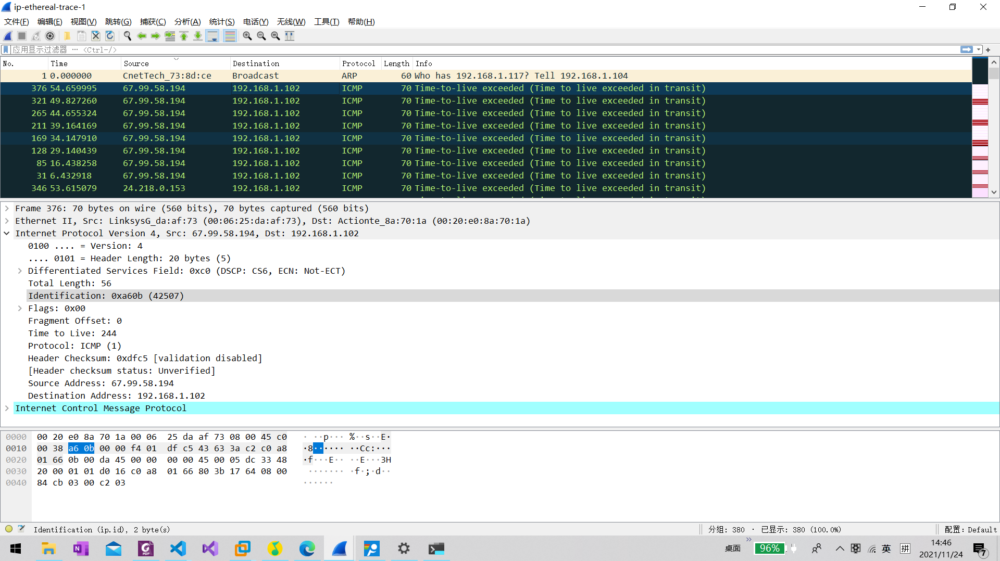
- 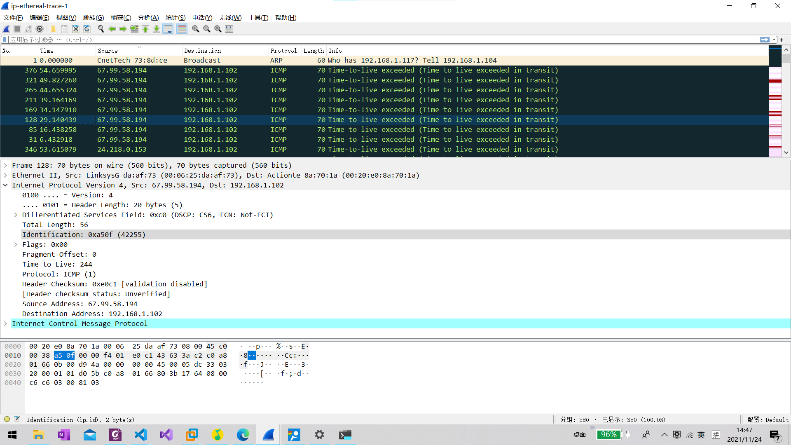
- 每个IP数据报的Identification是不同的，用来唯一地标识一个报文的所有分片和处理IP分片
- Identification 随数据报的发送而增长

### Q:8.What is the value in the Identification field and the TTL field?

- 
- Identification: 0xa60b (42507)
- Time to Live: 255

### Q:9. Do these values remain unchanged for all of the ICMP TTL-exceeded replies sent to your computer by the nearest (first hop) router?  Why?

- Identification 字段改变
- Time to Live 字段不改变，为255
- why:
      1. Identification变，每发一个IP datagram，Identification++;
      2. TTL 为 255不变。TTL初始最大值为 255 ，TTL每经过一个router才减1，因为题干是 nearest router，所以和发送方之间一个其它router都没有，所以TTL不会减，一直是255

### Q:10. Find the first ICMP Echo Request message that was sent by your computer after you changed the Packet Size in pingplotter to be 2000. Has that message been fragmented across more than one IP datagram

- 
- 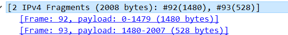
- 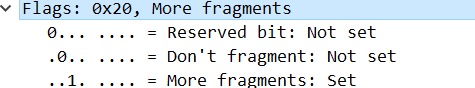
- 从图中可以看到已经分成2片了
- [Frame: 92, payload: 0-1479 (1480 bytes)]
- [Frame: 93, payload: 1480-2007 (528 bytes)]
- Frame92 总共2000 bytes = 20bytes + 1480bytes
- Frame93 总共548 bytes = 20bytes + 528bytes
- 第一片的More fragments: Set 表明已经分片了

### Q：11. Print out the first fragment of the fragmented IP datagram. What information in the IP header indicates that the datagram been fragmented?  What information in the IP header indicates whether this is the first fragment versus a latter fragment?How long is this IP datagram?

- 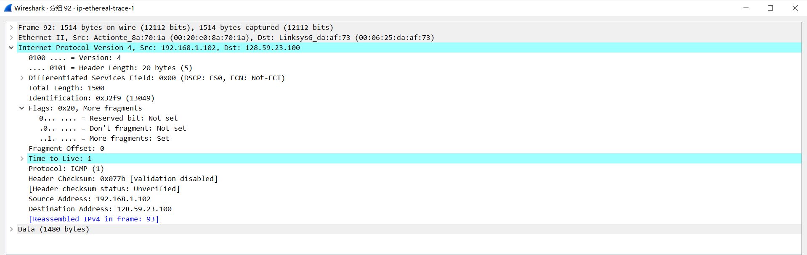
- IP头中`..1. .... = More fragments: Set`表示后面还有分片，所以已经被分片了。
- 根据Fragment Offset为 0 可以推出是第一个分片。
- 如果Fragment Offset不为 0，且More fragments为1，则表示为最后一个分片。
- Total Length: 1500 单位bytes，其中头部20 bytes，负载1480 bytes。

### Q：12. Print out the second fragment of the fragmented IP datagram. What information in the IP header indicates that this is not the first datagram fragment?  Are the more fragments?  How can you tell?

- 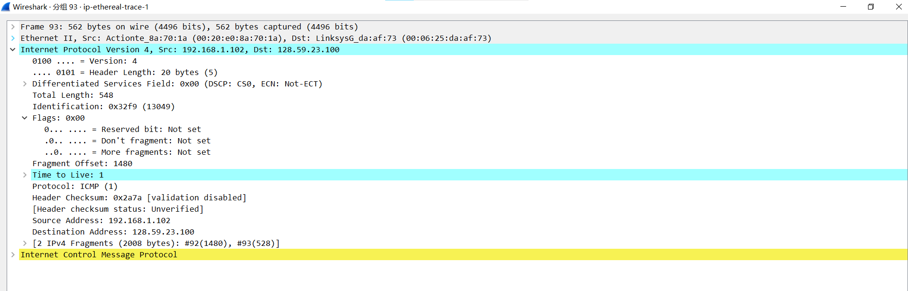
- Fragment Offset不为 0，而是 1480
- 没有更多的分片了，因为More fragments为0，More fragments: Not Set

### Q: 13. What fields change in the IP header between the first and second fragment?

- Frame
- Fragment Offset
- More fragments
- Total Length
- data
- header checksum
- 特别的：
  - flag的最后一位（More fragments）分别为：1  0
  - fragment offset分别为：0 1480
  - Total Length分别是 1500 548

### Q: 14. How many fragments were created from the original datagram?

- 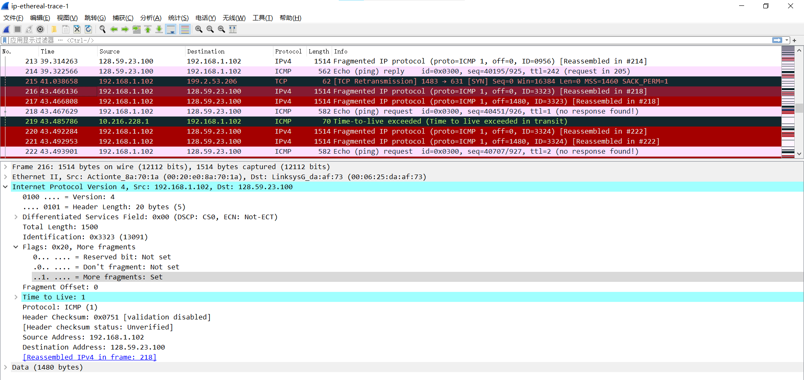
- 3个分片
- [3 IPv4 Fragments (3508 bytes): #216(1480), #217(1480), #218(548)]
- [Frame: 216, payload: 0-1479 (1480 bytes)]
- [Frame: 217, payload: 1480-2959 (1480 bytes)]
- [Frame: 218, payload: 2960-3507 (548 bytes)]

### Q: 15. What fields change in the IP header among the fragments?

- Frame
- Fragment Offset
- More fragments
- Total Length
- data
- header checksum
- 特别的：
  - flag的最后一位（More fragments）分别为：1 1 0
  - fragment offset分别为：0 1480 2960
  - Total Length分别是 1500 1500 568
