# Computer Network Study Lab 7

---

- Author:PB19000362 钟书锐
- Time:2021.12.9

## 1. Capturing and analyzing Ethernet frames
- First, make sure your browser’s cache is empty.
- Start Wireshark capture packet
- Enter the http://gaia.cs.umass.edu/wireshark-labs/HTTP-ethereal-lab-file3.html into browser 
- Stop Wireshark packet capture
- The result is below
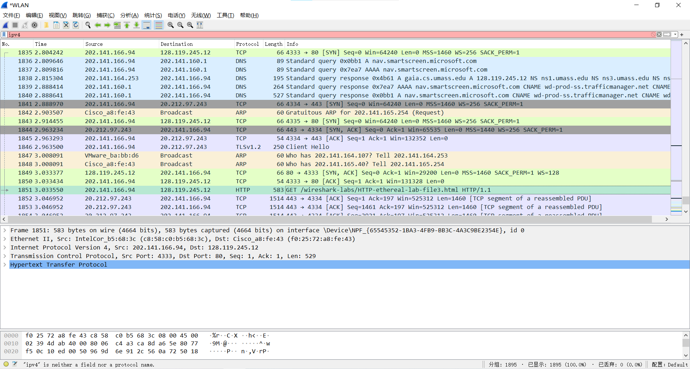
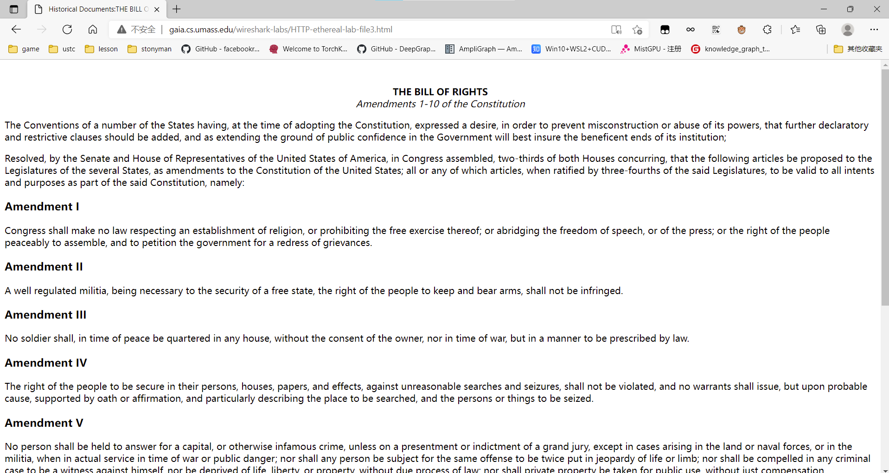

- Because the result is a little difficult to understand
- I will answer the question use the packet in http://gaia.cs.umass.edu/wireshark-labs/wireshark-traces.zip
- It result is below
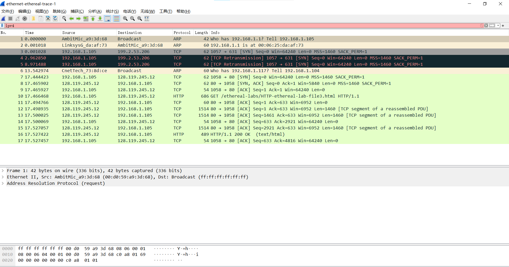

- select Analyze->Enabled Protocols，Then uncheck the IP box and select OK. 
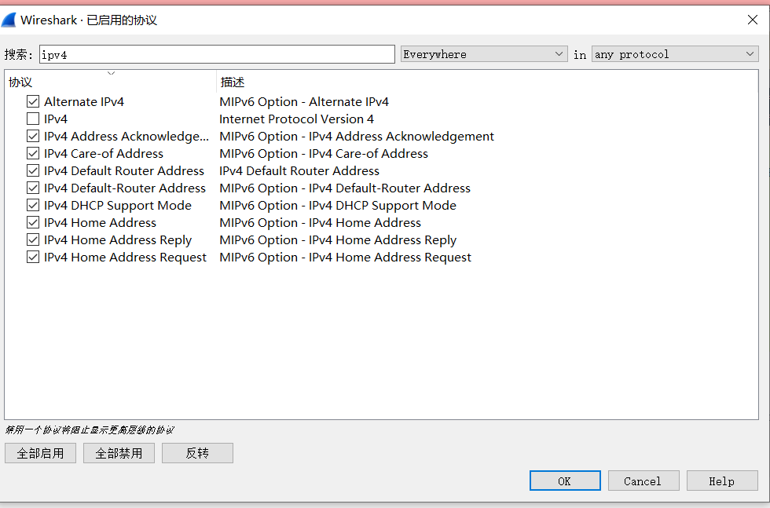
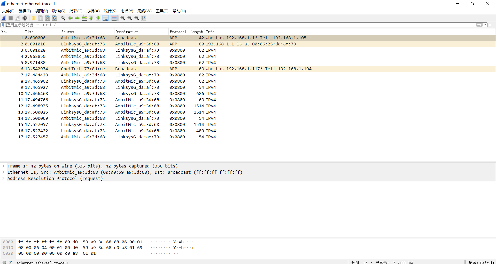

#### Q1. What is the 48-bit Ethernet address of your computer? 
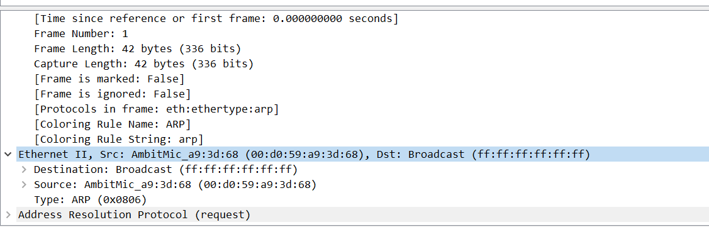
- Src: AmbitMic_a9:3d:68 (00:d0:59:a9:3d:68)
- The 48-bit Ethernet address of the computer is 00:d0:59:a9:3d:68

#### Q2. What is the 48-bit destination address in the Ethernet frame? Is this the Ethernet address of gaia.cs.umass.edu? What device has this as its Ethernet address?
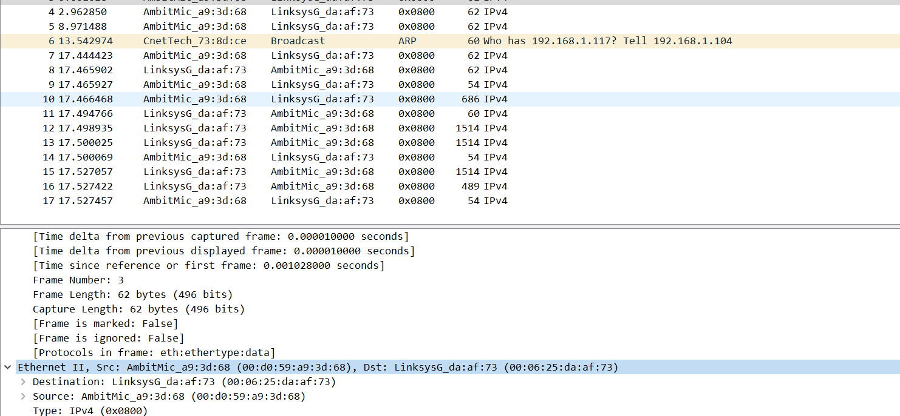
- Dst: LinksysG_da:af:73 (00:06:25:da:af:73)
- The 48-bit destination address in the Ethernet frame is 00:06:25:da:af:73
- Not the Ethernet address of gaia.cs.umass.edu
- This Address is the address of the Linksys router interface
- The Linksys is a famous router interface

#### Q3. Give the hexadecimal value for the two-byte Frame type field.  What upper layerprotocol does this correspond to? 
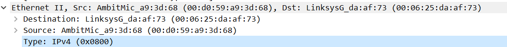
- The hexadecimal value is 0x0800，
- The upper layerprotocol this correspond to is IPv4

#### Q4. How many bytes from the very start of the Ethernet frame does the ASCII “G” in “GET” appear in the Ethernet frame? 
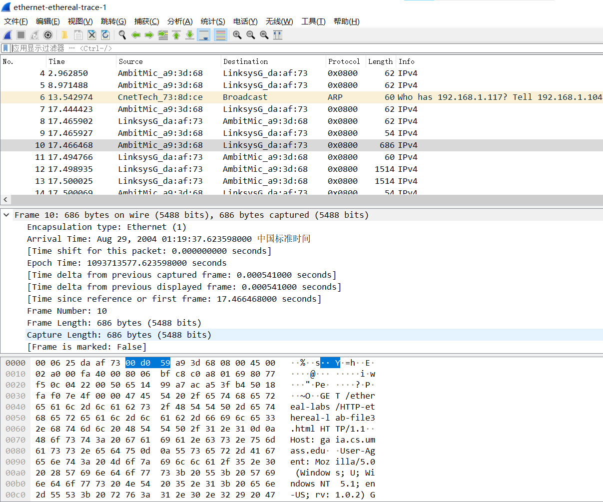
- 16*3+7 = 55 bytes

#### Q5. What is the value of the Ethernet source address?  Is this the address of your computer, or of gaia.cs.umass.edu (Hint: the answer is no).   What device has this as its Ethernet address? 
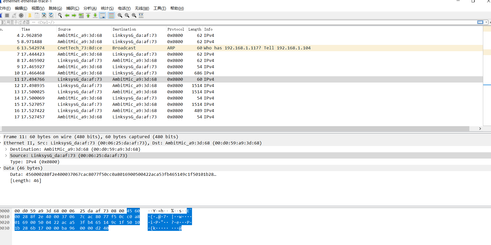
- Source: LinksysG_da:af:73 (00:06:25:da:af:73)
- The value is 00:06:25:da:af:73
- Not the address of my computer or gaia.cs.umass.edu
- The address of the Linksys router interface

#### Q6. What is the destination address in the Ethernet frame?  Is this the Ethernet address of your computer?  


- 00:d0:59:a9:3d:68
- This is the Ethernet address of my computer 

#### Q7. Give the hexadecimal value for the two-byte Frame type field. What upper layer protocol does this correspond to?

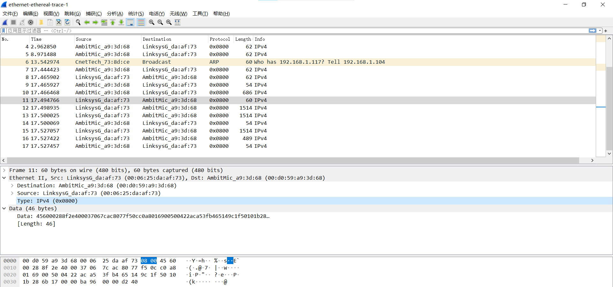
- The hexadecimal value is 0x0800，
- The upper layerprotocol this correspond to is IPv4


#### Q8. How many bytes from the very start of the Ethernet frame does the ASCII “O” in “OK” (i.e., the HTTP response code) appear in the Ethernet frame?

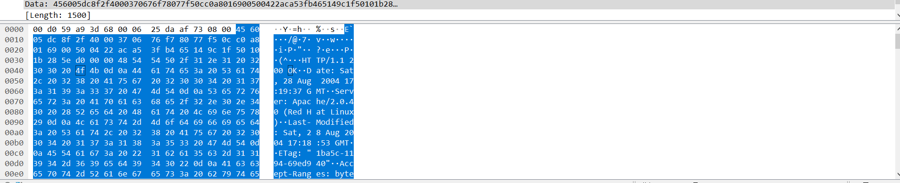
-  16*4+4 = 68 bytes

## 2. The Address Resolution Protocol 
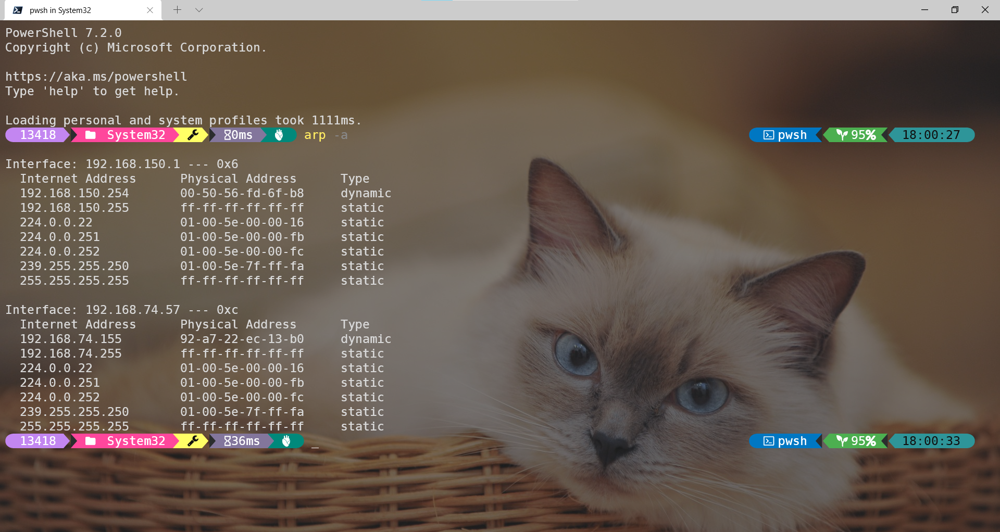
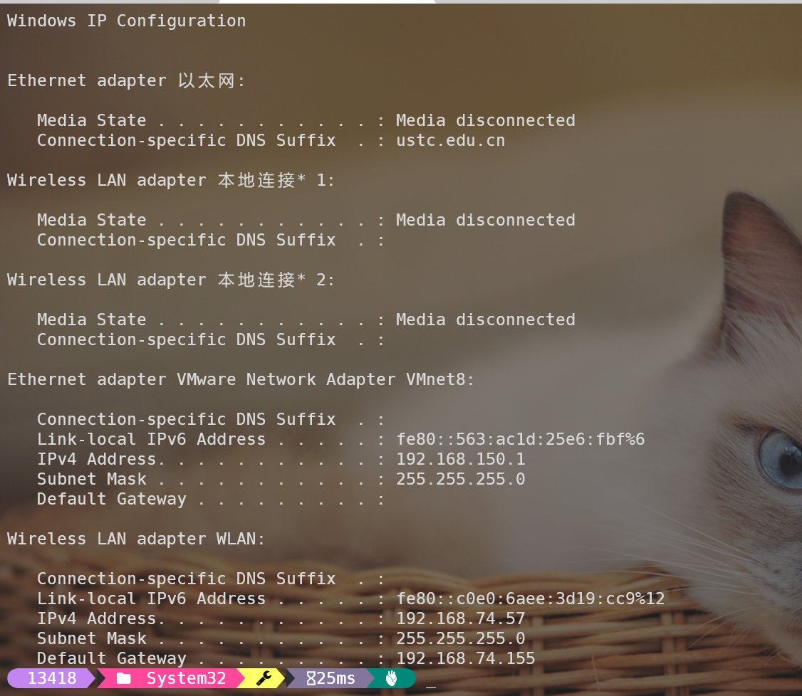

对照可知 ，分别为vmware的IP 和 本机的IP
#### Q9. Write down the contents of your computer’s ARP cache.  What is the meaning of 
each column value?

- 
- 路由 IP
- 
- MAC 地址
- 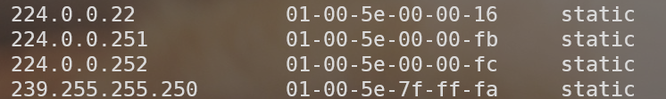
- 广播地址
- 
- 组播地址

#### Q10. What are the hexadecimal values for the source and destination addresses in the Ethernet frame containing the ARP request message? 
- 直接使用官方抓取的数据包
- ethernet-ethereal-trace-1 trace file in http://gaia.cs.umass.edu/wireshark-labs/wireshark-traces.zip
- 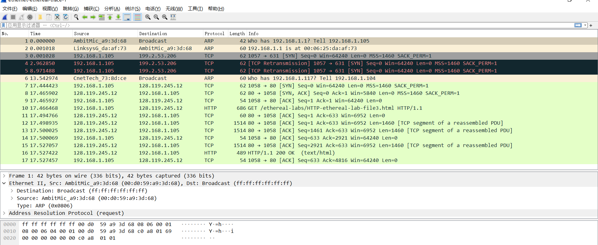
- Destination: Broadcast (ff:ff:ff:ff:ff:ff)
- Source: AmbitMic_a9:3d:68 (00:d0:59:a9:3d:68)

#### 11. Give the hexadecimal value for the two-byte Ethernet Frame type field.  What  upper layer protocol does this correspond to?
- 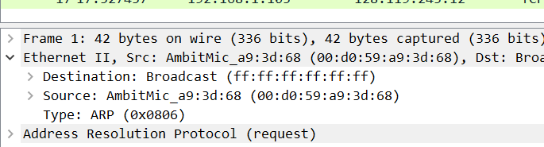
- 0x0806
- ARP

#### 12.Download the ARP specification

##### a) How many bytes from the very beginning of the Ethernet frame does the ARP opcode field begin?   
- 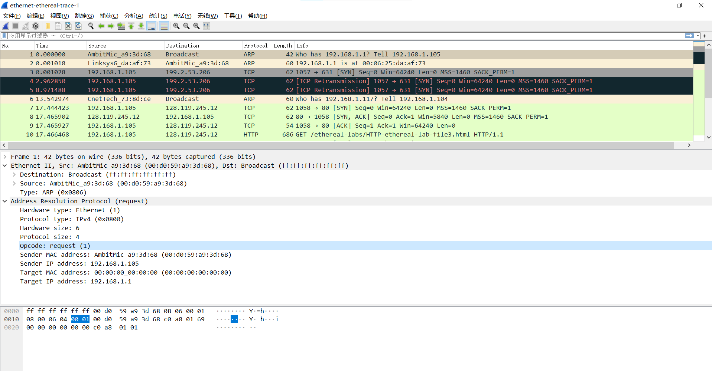
- 16 + 5 = 21bytes
##### b) What is the value of the opcode field within the ARP-payload part of the  Ethernet frame in which an ARP request is made? 
- 
- value of the opcode field：1
##### c) Does the ARP message contain the IP address of the sender? 
- 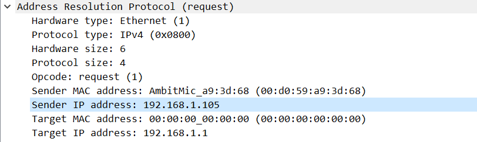
- contain
- Sender IP address: 192.168.1.105
##### d) Where in the ARP request does the “question” appear – the Ethernet address of the machine whose corresponding IP address is being queried? 
- 
- Target IP address
- when opcode request is 1 -> ARP request

#### 13. Now find the ARP reply that was sent in response to the ARP request. 
- 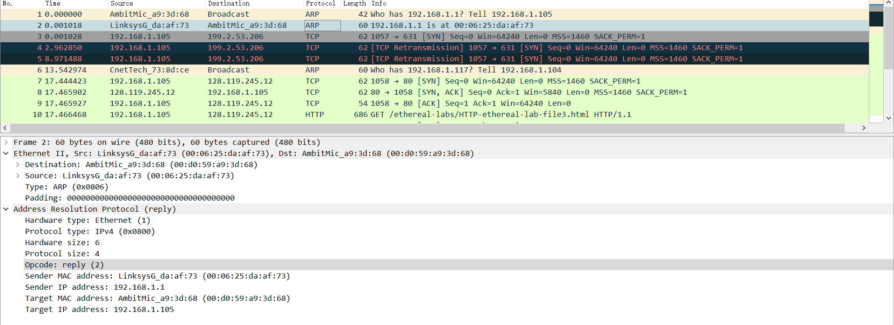
##### a) How many bytes from the very beginning of the Ethernet frame does the ARP opcode field begin?
- 16 + 5 = 21bytes
- 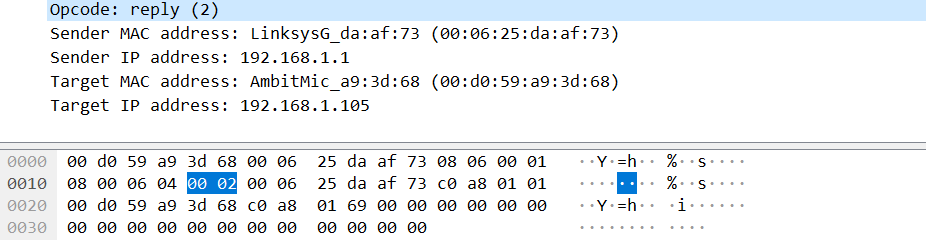
##### b) What is the value of the opcode field within the ARP-payload part of the Ethernet frame in which an ARP response is made? 
- 
- value of the opcode field：2
##### c) Where in the ARP message does the “answer” to the earlier ARP request appear – the IP address of the machine having the Ethernet address whose corresponding IP address is being queried?
- 
- when opcode request is 2 -> ARP reply
- Sender IP address

#### 14. What are the hexadecimal values for the source and destination addresses in the Ethernet frame containing the ARP reply message? 
- 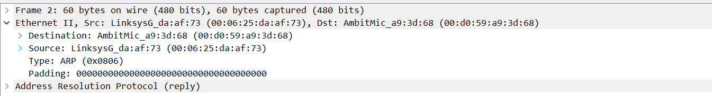
- Src: LinksysG_da:af:73 (00:06:25:da:af:73), Dst: AmbitMic_a9:3d:68 

#### 15. Why is there no ARP reply (sent in response to the ARP request in packet 6) in the packet trace?
- ARP request is broadcast, all computers can receive it.
- ARP reply is not broadcast, only the computer sent the request can receive it.

### EX-1 What would happen if, when you manually added an entry, you entered the correct IP address, but the wrong Ethernet address for that remote interface?    
`arp -d`
`arp -a`
- 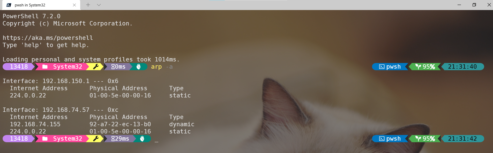
`ping 192.168.74.57`
- 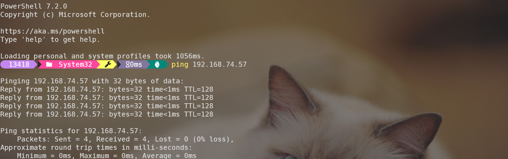
- correct  physical address is `c8:58:c0:b5:68:3c`
- `arp -s 192.168.74.57 c8-58-c0-b5-68-00`
- `arp -a`
- `ping 192.168.74.57`
- 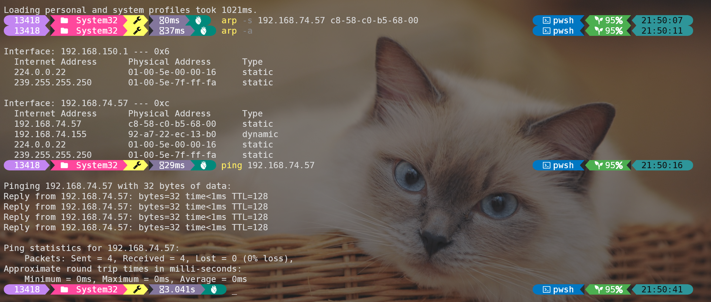
- It seems the ping 192.168.74.57 is ok.
- When use the `arp -s` the result of `arp -a` will change.

### EX-2 What is the default amount of time that an entry remains in your ARP cache 
before being removed.
`netsh interface ipv4 show interfaces`
- 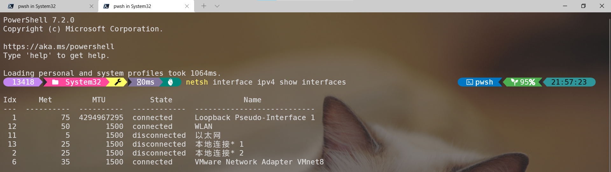
`netsh interface ipv4 show interfaces 12`
- 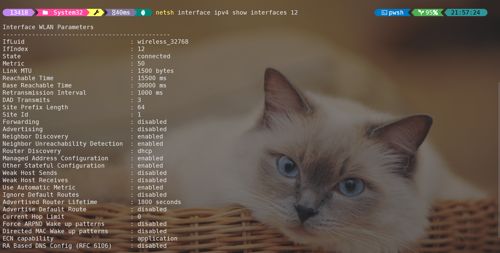
```
Advertised Router Lifetime         : 1800 seconds
```